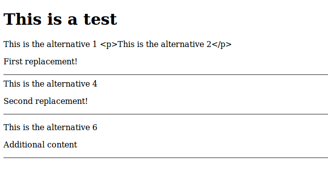

# Blade template engine
## Basics
See [documentation](https://laravel.com/docs/6.x/blade#introduction).

* To serve variables, write as `{{$post->body}}`. By default, html is escaped.
* To serve rendered html, write as `{!!$post->body!!}`
* To serve functions, write as `{{Str::limit($post->body)}}`
* Combine all to form: `<p class="card-text">{!!Str::limit($post->body)!!}</p>`
---
* `views/inc` folder will contain all included files, like sidebar, navbar, messages.
* `views/layout/app` will contain the full page structure with parts that will be overwritten by single pages.
* `views/pages` will contain simple pages.
* `views/posts` will contain all post oriented pages like create, edit, index, show`.

### Tips
Install VS code extension: `Laravel Blade Snippets` for highlighting Laravel blade syntax.

## Snippets
### `layouts.app`
Create `resources\views\layouts\app.blade.php` and put all repetitive html code, etc into it. But add `@yield('unique-name')` to that section of this page where you want other pages' contents to show up.

```html
<!doctype html>
<html lang="{{ str_replace('_', '-', app()->getLocale()) }}">
<head>
    <meta charset="utf-8">
    <meta name="viewport" content="width=device-width, initial-scale=1">

    <!-- CSRF Token -->
    <meta name="csrf-token" content="{{ csrf_token() }}">

    <title>{{ config('app.name', 'Laravel') }}</title>

    <!-- Scripts -->
    <script src="{{ asset('js/app.js') }}" defer></script>

    <!-- Fonts -->
    <link rel="dns-prefetch" href="//fonts.gstatic.com">
    <link href="https://fonts.googleapis.com/css?family=Nunito" rel="stylesheet">

    <!-- Styles -->
    <link href="{{ asset('css/app.css') }}" rel="stylesheet">

    <!-- or -->
    <link rel="stylesheet" href="css/app.css">

</head>
<body>
    @include('inc.navbar')

    <div class="container mt-3">
    <!-- https://laravel.com/docs/6.x/urls#generating-basic-urls -->
    <a href="{{ url('/home') }}">{{ config('app.name', 'Laravel') }}</a>
        <div class="row">
            <div class="col-md-8 col-lg-8">

                @if (Request::is('/'))
                    {{-- Show a jumbotron only on home page --}}
                    @include('inc.showcase')
                @endif
                
                {{-- Display Errors, successes, etc --}}
                @include('inc.messages')

                @yield('content')

            </div>
            <div class="col-md-4 col-lg-4">

                @include('inc.sidebar')

            </div>
        </div>
    </div>
    

    <div id="footer" class="text-center">
        <p>Copyright 2020</p>
    </div>
        
</body>
</html>
```

Similarly, including other files like navbar. Assuming it's located at `resources\views\inc\navbar.blade.php`, add 

```php
@include('inc.navbar')
```
to `resources\views\layouts\app.blade.php`.

#### Notes
1. For `<title>` tag, the code below searches `.env` for `APP_NAME=` and uses its value. If not existing, uses `'LSAPP'`
    ```html
    <title>{{config('app.name', 'LSAPP')}}</title>
    ```
1. For assets, similar code. Here we import the compiled css which is in `public/css/app.css`, same for js and some other stuff. Place this in `layouts.app`

### Individual pages
Then go to those pages in `resources\views\pages\` and add:
```php
@extends('layouts.app')

@section('unique-name')
    <h1>{{$title}}</h1>
    <p><?php echo $title; ?>: This is allowed by Blade</p>
    <p>Text, etc that will display in the yield section</p>

    // This is Blade code to write php.
    // Here, we use the variables this page was passed
    @if (count($services)>0)
        <ul>
            @foreach ($services as $service)
                <li>{{$service}}</li>
            @endforeach
        </ul>
    @endif
@endsection
```
Only the tricky parts are shown. See [documentation](https://laravel.com/docs/6.x/blade#extending-a-layout).


# Yield vs Section
[Stack Overflow question](https://stackoverflow.com/questions/29070456/laravel-difference-between-yield-and-section)
* @section('section-name') is defined in parent. Use @show to display the child. But it will get overwritten by child, unless child uses @parent directive. In child, use @section('name') ... @endsection.
* Then @show is also in the parent anywhere below @section, to show the content of the child's section of the same name
* @parent in the child, within the section will display the parent's section content as well (ie. Append to parent), otherwise it will overwrite it with just its own content.
* @yield('title') in parent will get a section from the child and overwrite itself even if had a default value. ie.@yield('title', 'Default string but no html') will be overwritten by @section('title', 'Page Title'). If the child does not have a section by the name, it'll display its own default value if provided. Else nothing.

Here some examples:`test.blade.php`
```html
<!DOCTYPE html>
<html>
  <head>
    <meta charset="utf-8">
    <title>Test</title>
  </head>
  <body>
    <h1>This is a test</h1>

    @yield('mainA')
    @yield('mainB', 'This is the alternative 1')
    @yield('mainC', '<p>This is the alternative 2</p>')
    @yield('mainD', 'This is the alternative 3')

    @section('testA')
    @show

    @section('testB')
      This is the alternative 4
    @show

    @section('testC')
      <p>This is the alternative 5</p>
    @show

    @section('testD')
      <p>This is the alternative 6</p>
    @show


  </body>
</html>
```
here is another file called `testA.blade.php` which extends the other bladed file:
```html
@extends('test')

@section('mainD')
  <div>
    <p>First replacement!</p>
    <hr>
  </div>
@endsection

@section('testC')
  <div>
    <p>Second replacement!</p>
    <hr>
  </div>
@endsection

@section('testD')
  @parent
  <div>
    <p>Additional content</p>
    <hr>
  </div>
@endsection
```
And the result is:

